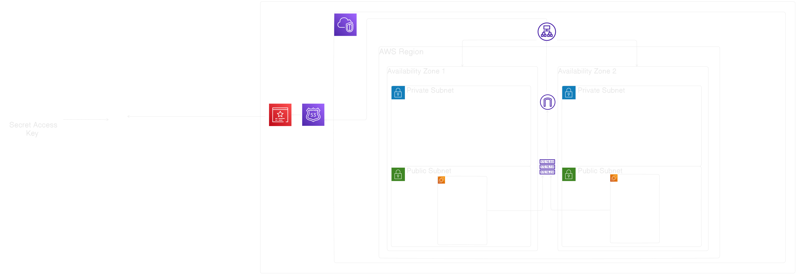

# Jenkins on EC2

### <p>This repository contains Terraform configurations to provision a complete AWS infrastructure, including an EC2 instance, VPC, Security Groups, Load Balancer, Load Balancer Target Group, Hosted Zone, and ACM (AWS Certificate Manager) certificate for hosting a *Jenkins* server</p>



### **Prerequisites**
1. [Install AWS CLI](https://docs.aws.amazon.com/cli/latest/userguide/getting-started-install.html)
2. [Install Terraform](https://developer.hashicorp.com/terraform/tutorials/aws-get-started/install-cli)

### Configuring AWS
***Step 1:*** Generate Access And Secret Keys<br>
***Step 2:*** `aws configure`<br>
***Step 3*** Copy and Paste **AccessKeyId** and **SecretAccessKey**
### Cloning the repository
`git clone https://github.com/sharqX/jenkins-on-ec2.git`
### Deploying the infrastructure
***Step 1*** Generate SSH key for EC2 with help of
`ssh-keygen` and change key_name in `main.tf` in `jenkins-on-ec2/jenkins-ec2` and `public_key` in `terraform.tfvars` <br>
***Step 2*** Create terraform.tfvars <br>
```
#networking
vpc_cidr             = "10.0.0.0/16"
vpc_name             = "VPC Name"
private_subnet_cidr  = ["10.0.1.0/24", "10.0.2.0/24"]
public_subnet_cidr   = ["10.0.3.0/24", "10.0.4.0/24"]
ap_availability_zone = ["zone1", "zone2"]

#ec2
ami_id     = "ami-id of your choice"
public_key = "Your public key"
```
> [!WARNING] 
> You need to have your own domain name<br>
> [!TIP]
> You can buy your own domain name on [GoDaddy](www.godaddy.com) or [Squarepace Domains](domains.squarespace.com)<br>

***Step 3*** change `domain_name` and `subdomain_name` in main.tf <br>
***Step 4*** `terraform init`<br>
***Step 5*** `terraform plan`<br>
***Step 6*** `terraform apply -auto-approve`<br>

### Destroying the infrastructure

`terraform destroy -auto-approve`